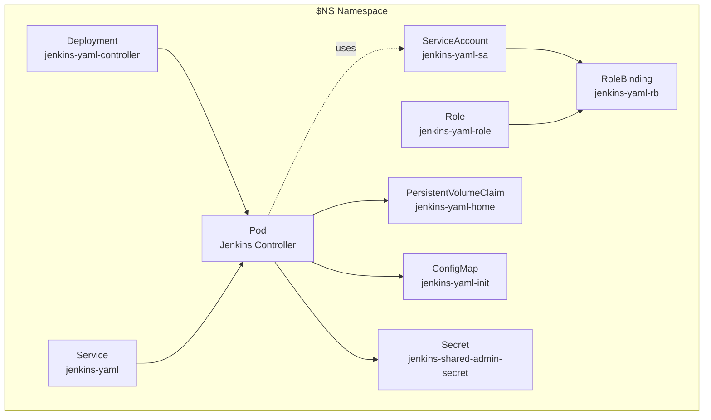

# Jenkins on Kubernetes

This repository contains the necessary files and configurations to deploy Jenkins on a Kubernetes cluster using:

1. YAML
2. Helm charts

## Prerequisites

- Local k8s install

## Setup

1. Using an environment file (ie, `.env`) other method, export variables for the configuration into the current session.

    ```bash
    export NS=jenkins
    export JENKINS_ADMIN_ID=admin
    export JENKINS_ADMIN_PASSWORD=qwerty  # Use a value from `openssl rand -base64 18`
    ```

1. Create the namespace using [namespace.yml](./namespace.yml).

    ```bash
    kubectl apply -f namespace.yaml
    ```

1. Create a secret for Jenkins credentials

    ```bash
    kubectl -n "$NS" delete secret jenkins-shared-admin-secret --ignore-not-found
    kubectl -n "$NS" create secret generic jenkins-shared-admin-secret \
      --from-literal=JENKINS_ADMIN_ID="$JENKINS_ADMIN_ID" \
      --from-literal=JENKINS_ADMIN_PASSWORD="$JENKINS_ADMIN_PASSWORD"
    ```

## Deploy Jenkins Using YAML Configurations

### Resources and Configurations

The following files will be used to create the needed resources:

| File Name | Resource | Overview / Explanation |
| --------- | -------- | ---------------------- |
| **01-service-account.yaml** | ServiceAccount | Creates a dedicated service account `jenkins-yaml-sa` for the Jenkins controller pod to use. |
| **02-role.yaml** | Role | Grants namespace-scoped permissions for Jenkins to manage pods, services, secrets, and related resources. |
| **03-role-binding.yaml** | RoleBinding | Binds the `jenkins-yaml-sa` service account to the Role so Jenkins can actually use those permissions. |
| **04-persistent-volume-claim.yaml** | PersistentVolumeClaim | Reserves 20 Gi of storage to persist Jenkins home data across pod restarts. |
| **05-configmap-init.yaml** | ConfigMap | Provides a Groovy init script that sets up Jenkins security, creating the admin user from Secret values. |
| **06-deployment.yaml** | Deployment | Runs the Jenkins controller pod, mounting the PVC and ConfigMap, and injecting admin credentials via Secret. |
| **07-service.yaml** | Service | Exposes the Jenkins controller internally (HTTP 8080 + agent port 50000) so you can port-forward or hook up Ingress. |

The following diagram shows how the resources come together:



### Deployment and Service Rollout

1. Create resources by applying all the files in the `./yaml-config` directory at once:

    ```bash
    kubectl -n "$NS" apply -f ./yaml-config
    ```

    Or apply them once at a time in the number they are ordered.

1. Follow the deployment.

    ```bash
    kubectl -n "$NS" rollout status deployment/jenkins-yaml-controller
    ```

1. When the deplopyment completes, review the resources:

    ```bash
    kubectl -n "$NS" get pods,svc,pvc -l app.kubernetes.io/name=jenkins-yaml
    ```

### Connect to the Jenkins Web Interface

1. Use port forwarding to connect localhost to the Jenkins service.

    ```bash
    kubectl -n "$NS" port-forward svc/jenkins-yaml 8080:8080
    ```

1. Open [http://localhost:8080](http://localhost:8080).

    Use the the values for `JENKINS_ADMIN_ID` (Username) and `JENKINS_ADMIN_PASSWORD` (Password) to login.

1. Enter `ctrl+c` to end the port-forwarding session.

#
